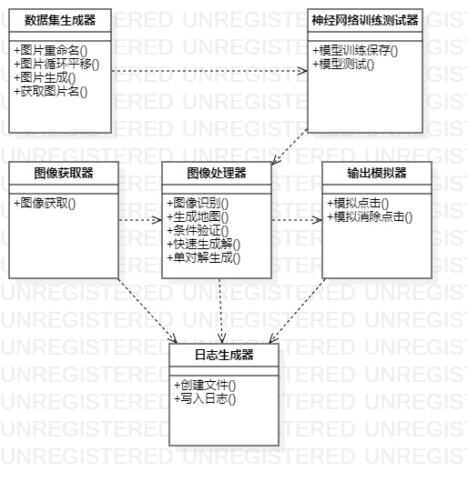
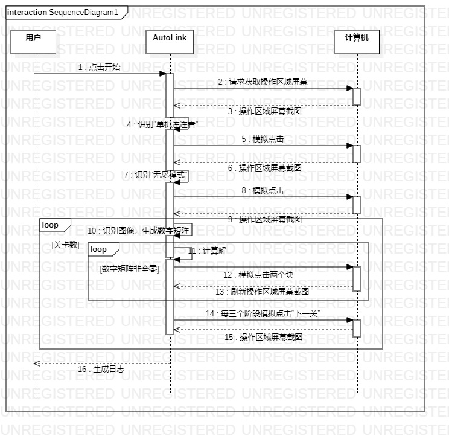

[toc]

# 基于Python的连连看自动操作器

## 1 设备与环境

### 1.1 设备

- CPU：Intel CORE i5
- 显卡：NVIDIA GTX950M
- 内存：12GB
- 系统：Windows 10

### 1.2 环境

- IDE：PyCharm
- Python版本：Python3.6
- 主要Python包：
  - cv2(OpenCV)
  - PIL(pillow)
  - torch(PyTorch)
  - NumPy
  - win32gui, win32ui, win32con,
  - visdom
- 游戏模拟器：LDPlayer
- 连连看游戏：单机连连看

## 2 实现思路

### 2.1 类图

#### 2.1.1 图像获取器

- 图像获取：获取雷电模拟器软件截图，用于后续处理

#### 2.1.2 图像处理器

- 图像识别：使用cv中的匹配模型，输入匹配图片，在screen中查找对应图像的位置。如“下一关”按钮的位置。
- 生成地图：获取screen中游戏区域，根据长宽分割出每一个块，根据神经网络训练测试器得到的网络模型识别块对应的类别，生成对应的数字矩阵。
- 条件验证：验证给定的两个位置是否符合连连看消去条件
- 快速生成解：遍历数字矩阵每对点，并验证是否符合消去条件
- 单对解生成：只得到一对可消去点坐标。用于解决有的图每消去一对就会改变图格局的情况。

#### 2.1.3 输出模拟器

- 模拟点击：模拟鼠标点击图像识别得到的位置
- 模拟消除点击：模拟鼠标点击符合条件的一对位置坐标

#### 2.1.4 数据集生成器

- 图片重命名：将得到的原始数据图片按照规定格式命名
- 图片循环平移：循环平移图片
- 图片生成：调用图片循环平移，将一张原始图片向上向下向左向右循环平移对应像素
- 获取图片名：获取图片名称

#### 2.1.5 神经网络训练测试器

- 模型训练保存：训练CNN模型，并将训练好的模型保存下来
- 模型测试：测试训练好的模型

#### 2.1.6 日志生成器

- 创建文件：创建空的日志文件
- 写入日志：将日志信息写入日志文件

### 2.2 时序图

#### 2.2.1 游戏流程

首先我们得手动打开雷电模拟器，进入单机连连看。之后的操作都是由程序进行。

1. 获取屏幕截图，查找并点击“单机连连看”按钮
2. 获取屏幕截图，查找并点击“无尽模式”按钮
3. 获取屏幕截图，划分块，将每一块分类，生成对应数字矩阵
4. 根据数字矩阵通过连连看算法得出解
5. 根据解模拟鼠标点击消去块
6. 一关有三个阶段，每三个阶段后，获取屏幕截图，查找并点击“下一关”按钮
7. 一直循环玩下去……

#### 2.2.2 特殊情况

##### 地图长宽块数改变

- 如果我们不想玩无尽模式（无尽模式的地图大小为7\*6），想玩如极速模式（极速模式的地图大小为11\*8），需要将程序中的`ROW_NUM`和`COL_NUM`修改为对应值

##### 块位置改变

- 有的地图会出现每消去一对块就会更改原地图其他块位置
- 如果出现无解情况，游戏会自动重新排版块位置

##### 新块生成

- 如地狱模式中每消去若干对块会刷新出新的一对块

对于上述情况，均可以使用**单对解生成**方式。

## 3 待存在问题与思路

### 3.1 存在的问题

使用**单对解生成**能够解决很多特殊情况，但是，游戏中连续点击成功会出现“连击数”，如果在程序中设置等待2秒（等待连击消失），连击数字样会对地图进行遮挡，在接下来的截图识别中影响识别结果。

如果不设置等待2秒，会导致结果处理太慢，使得不能够在规定时间内解决连连看问题。

### 3.2 解决思路

#### 3.2.1 方案一

扩充数据集数据，将被连击数部分遮挡的块加入数据集，改良训练模型。

#### 3.2.1 方案二

采用**快速生成解**和**单对解生成**交替使用，使得处理特殊情况时速度变快，准确率变高。

#### 3.2.3 方案三

对于每次解完一个阶段/一关（无尽模式一关含3个阶段），会出现下一个阶段/下一关的提示。根据是否出现下一个阶段/下一关的提示，来判断本阶段/本关是否解完，否则一直运行**生成地图**和**快速生成解**。

## 4 使用方法

- 配置好环境（最好为对应版本）。
- 用到的软件、图片、模型和数据集我免费放在CSDN下载中，也可自己下载和训练。
- 如果需要玩其他模式，请手动设置到对应的`ROW_NUM`和`COL_NUM`。
- 进入游戏主菜单，运行程序。